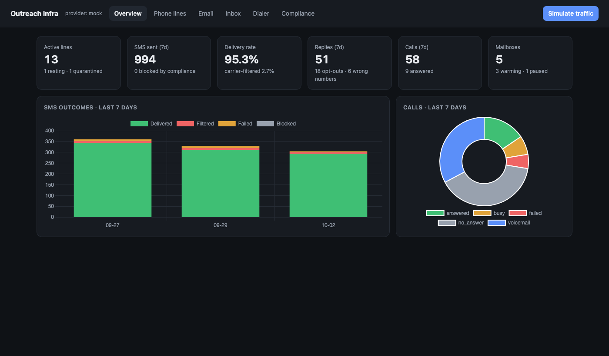

# Outreach Infra

A working prototype of the outbound infrastructure for reaching property owners over **SMS, email and voice**. Its core is an **SMS and email pipeline** that:

- runs multi-step campaigns across both channels
- picks sending phone lines and mailboxes within their health, warm-up, and pacing limits
- passes every message through a compliance gate
- processes replies, bounces, out-of-office messages, complaints, and unsubscribes as they arrive

Around that core are phone-line health and spam monitoring, sending-domain health and blacklist checks, mailbox warm-up, a unified inbox, a dialer, and background jobs that keep it all running.

It runs end to end on **simulated providers**, so you can try every feature without paying for numbers or mailboxes. Set `TELEPHONY_PROVIDER=twilio` or `EMAIL_PROVIDER=smtp` to use real ones.

- **How email and SMS work, step by step:** [docs/EMAIL_AND_SMS.md](docs/EMAIL_AND_SMS.md)
- **Sending ~3M cold emails a month: capacity, Instantly vs alternatives, unit economics:** [docs/SCALE_AND_UNIT_ECONOMICS.md](docs/SCALE_AND_UNIT_ECONOMICS.md)
- **R&D → production plan:** [docs/ROADMAP.md](docs/ROADMAP.md)



## Quick start

```bash
python3 -m venv .venv && source .venv/bin/activate
pip install -r requirements.txt
uvicorn app.main:app --reload
# open http://localhost:8000
```

The first start takes about 20 seconds. In that time the app replays a week of outreach **through the real campaign engine**:

- 15 phone lines in 5 metros, and 240 leads
- an SMS campaign and an email campaign
- 3 sending domains and 5 mailboxes at different warm-up stages
- the dispatcher run every 15 simulated minutes

Only the recipients are simulated (replies, opt-outs, out-of-office messages, bounces, complaints), so every number on the dashboard comes from production code paths. Scenarios built into the demo:

| You'll see | Because |
|---|---|
| A Miami line rested with a "Spam Likely" label | It's a recycled number with a bad history; the health monitor catches it |
| `acmehomesdeals.com` paused, and its mailbox sends nothing | The domain has no DKIM/DMARC |
| Email going out only Monday to Friday, 8am–6pm local time | The email sending window |
| Phoenix texts sent at 8:00 local time, not 7:00 | Quiet hours are per recipient time zone, and Arizona has no daylight saving time; messages wait instead of being dropped |
| Leads with `gmial.com` addresses, landlines, and dead mailboxes skipped or suppressed | Recipient verification and line-type lookup |
| No mailbox sending more than one campaign email every 6 minutes, or more than its daily cap | Pacing and warm-up-aware quotas |

With Postgres: `docker compose up --build` (app on :8000, Postgres on :5432).

Tests: `pytest` runs 110 tests in about 5 seconds. There are no migrations yet, so after pulling schema changes, delete `outreach.db` (and `outreach.db-wal` / `outreach.db-shm` if present) and restart.

## What to try in the dashboard

| Tab | What it does |
|---|---|
| **Overview** | 7-day SMS, email, and call outcomes, plus the campaign pipeline |
| **Campaigns** | Each campaign's pipeline (active / replied / completed / stopped). **View** shows its steps with content checks, and every lead's current step, next send time, and reason (e.g. "deferred: outside 8am-9pm"). Activate, pause, or enroll leads. Background jobs show their last result, with a **Run** button for each. **New campaign** checks the content of each step as you type. |
| **Scale & cost** | Enter a monthly volume and get the inboxes, domains, and warm-up time it needs, plus the monthly cost, cost per 1k emails, and cost per reply for Instantly / Smartlead with Google, Microsoft, Mailforge, or Infraforge inboxes, or a fully in-house build. Every price is editable, with its source. |
| **Phone lines** | Health score, spam label, daily usage, and why a line was rested or quarantined. Buy, rest, reactivate, or replace lines. Click a number to see its health history. |
| **Email** | **Live** SPF/DKIM/DMARC/MX checks and **live** blacklist checks for any domain. **Live** email-address verification. Per-domain status and 7-day bounce rate. Each mailbox's warm-up curve, warm-up volume, and cold-email quota used today. |
| **Inbox** | SMS and email replies threaded per lead (bounces and out-of-office messages filtered out). Reply by SMS or email; email replies thread under the original message, from the same mailbox. |
| **Dialer** | 1/2/3/5-line sessions with a 30-day abandon rate. Lines drop automatically above the 3% limit. |
| **Compliance** | The suppression list: opt-outs, DNC, wrong numbers, bounces, complaints, unsubscribes |

**Simulate traffic** adds 20 new leads, enrolls them in the active campaigns, and runs the dispatcher. Outside sending hours you'll see them scheduled for later instead of sent.

## Architecture

```
            Dashboard (static HTML + Chart.js)          Recipients: unsubscribe page /u/{token}
                         │ REST                                      │
┌────────────────────────▼──────────────── FastAPI ──────────────────▼─────────────────────────┐
│ api.py: campaigns · lines · email · inbox · dialer · suppressions · scheduler                │
│ webhooks: /webhooks/sms/inbound · /sms/status (Twilio, signed) · /email/inbound (shared key) │
└────────────────────────┬─────────────────────────────────────────────────────────────────────┘
                         │
┌────────────────────────▼──────── services/ (business logic, no HTTP) ────────────────────────┐
│ campaigns       sequences + dispatcher: send / defer / skip / stop each due step             │
│ compliance      THE gate: suppression, quiet hours, frequency cap, opt-out language          │
│ sms             line selection (sticky → local → healthiest), pacing, inbound STOP/START     │
│ email_sender    mailbox selection, RFC-compliant messages, threading, inbound classification │
│ email_verify    syntax / typo / disposable / MX / role-account checks                        │
│ content_lint    SMS segments + encoding, shorteners, opt-out wording, SHAFT, spam phrases    │
│ line_health     line score, rest/quarantine, spam labels       warmup   mailbox ramp + pause │
│ domain_health   auth + blacklists + domain-wide bounce/complaint limits → pause domain       │
│ enrollment_events   a reply / opt-out / bounce stops sequences the moment it arrives         │
│ dialer · provisioning · email_auth (live DNS) · simulation (demo only)                       │
└──────────────┬──────────────────────────────────────────────┬────────────────────────────────┘
               │ TelephonyProvider                            │ EmailProvider
     MockCarrier │ TwilioCarrier                     MockEmailProvider │ SMTPEmailProvider
                                                     (Gmail API / Microsoft Graph: same interface)

scheduler.py (background thread): dispatcher 30s · line health 15m · spam labels, domain health 24h · warm-up 6h
```

Data lives in SQLAlchemy models ([app/models.py](app/models.py)), on SQLite (WAL mode) locally and on Postgres in Docker or production.

### Working with Instantly / Smartlead

At millions of emails a month, sending, inbox rotation, and warm-up are far cheaper to rent than to build ([why](docs/SCALE_AND_UNIT_ECONOMICS.md#3-would-i-use-instantly-yes-for-sending-and-why)). The provider interface lets this system act as the layer around the sending platform:

- `POST /api/integrations/instantly/push` pushes compliant, verified leads into an Instantly campaign (set `INSTANTLY_API_KEY`).
- Instantly webhooks post to `/webhooks/instantly`. Replies, bounces, and unsubscribes update the shared suppression list and stop the lead's SMS sequences too.

## Key design decisions

The full walkthrough is in [docs/EMAIL_AND_SMS.md](docs/EMAIL_AND_SMS.md). The short version:

**Defer, don't drop.** When a campaign step can't go out right now, the dispatcher decides what happens next:
- **Wait:** outside quiet hours, frequency cap reached, a mailbox or line is pacing, or no capacity left today. The step is rescheduled for the next allowed time.
- **Skip:** a landline, an invalid address, or a missing channel. The sequence continues with the next step.
- **Stop:** the person opted out, bounced, or complained.

A message is never silently lost, and every decision is visible per lead in the Campaigns tab.

**One compliance gate.** `compliance.check()` runs before every text, call, and email, including inbox replies. It returns `send | defer(retry_at) | skip | stop`. It covers:
- suppression (opt-out, DNC, wrong number, bounce, complaint, unsubscribe)
- TCPA quiet hours in the recipient's time zone, conservative when the zone is unknown
- at most 3 texts and calls per phone number per 24h, the Florida, Oklahoma, and Maryland limit
- natural-language opt-outs ("please stop texting me"), which the FCC has required honoring since April 2025

**A reply stops automation everywhere, immediately.** An inbound reply on any channel closes all of that person's active sequences at once, matched by phone or email. Out-of-office messages and bounces don't count as replies.

**Email follows the 2024 Gmail/Yahoo bulk-sender rules:**
- SPF, DKIM, and DMARC are required. A domain missing any of them is paused automatically.
- RFC 8058 one-click `List-Unsubscribe` headers, plus a CAN-SPAM footer with a physical address.
- The unsubscribe link needs a confirming **POST**, because corporate link scanners open every URL in an email and would otherwise unsubscribe people who never clicked.
- Spam complaints suppress the address and count against the mailbox and domain.

**Protect the sending assets:**
- Mailboxes send no campaign email before warm-up day 14, then ramp up to a daily cap.
- Each mailbox waits at least 6 minutes between campaign emails, and each line 20 seconds between automated texts.
- Scheduled sends are spread out randomly, so a batch of leads doesn't all go out at 8:00:00.
- A follow-up must come from its thread's mailbox, inside that mailbox's limits.
- A bad domain pauses only its own mailboxes; the others keep sending.

**Separate list problems from asset problems:**
- Landline and dead-number errors don't hurt a line's health score.
- Bad addresses are caught before sending (typo domains, disposable providers, no MX record).
- Line type is looked up once per lead, and landlines skip SMS steps.

**Check content before sending.** A campaign can't be activated while any step has content errors:
- public link shorteners
- a first text without opt-out wording
- unknown merge fields
- SHAFT (sex, hate, alcohol, firearms, tobacco) and cannabis content

Warnings flag cost and deliverability problems without blocking activation. For example, a single curly apostrophe (’) switches a text from 160 to 70 characters per segment.

**Line health:** the score uses the carrier-filter rate, opt-out rate, spam label, and reply rate. Below 70 a line rests for 48h; below 50 it's quarantined. When a rest ends, the label is checked again and the metrics window resets, so the line is judged on new traffic.

## What's real vs simulated

| Real | Simulated / stubbed |
|---|---|
| Campaign engine, dispatcher, compliance gate, pacing, quotas, threading, inbound classification | Carrier delivery and filtering, call outcomes (`MockCarrier`) |
| Live DNS: SPF (recursive 10-lookup count), DKIM, DMARC, MX, DNS blacklists (Spamhaus DBL, SURBL, URIBL), recipient MX | Recipients' replies, bounces, out-of-office messages, complaints (demo seed only) |
| RFC 5322 / 8058 message construction, signed unsubscribe links, one-click unsubscribe endpoint | Spam-label lookups (production: Hiya / TNS / First Orion) |
| SMTP sending adapter, Twilio REST adapter (send, buy, call, line-type lookup), webhook signature checks | The warm-up network, and inbox-placement seed tests |
| Line health, domain health, warm-up gating, background scheduler | iMessage (roadmap: research only) |

The Twilio and SMTP adapters follow their protocols but have **not** been run against live accounts.

### Known limitations (next steps)

- **No authentication** on the API or dashboard. Add login and roles before any real deployment.
- **Inbound email arrives through a webhook.** Production needs a poller per mailbox (Gmail API watch, Microsoft Graph subscriptions, or IMAP IDLE) posting to `/webhooks/email/inbound`.
- **The scheduler is an in-process thread.** At scale, move jobs to a queue (Celery or RQ with Redis) with one dispatcher process.
- **Verification stops at MX.** Mailbox-level SMTP verification (ZeroBounce, NeverBounce) would catch dead mailboxes before the first send.
- **Daily caps reset at midnight UTC.** The area-code time-zone map is partial. There are no migrations yet (Alembic is next).

## About "stealth / protection"

I built *protection* as keeping our own infrastructure healthy and recoverable: pacing, quotas, warm-up gating, isolated domains, rest/quarantine/replace for lines, and automatic domain pauses. I deliberately did **not** build tools to evade carrier or mailbox spam filters (content spinning, snowshoeing, spoofing). That's how a 10DLC brand or a set of domains gets banned outright, and it creates TCPA liability. More in [docs/ROADMAP.md](docs/ROADMAP.md#stealth--protection).

## Project layout

```
app/
  main.py            app startup: tables, demo seed, scheduler, routers
  api.py             REST endpoints, webhooks, unsubscribe pages
  scheduler.py       background jobs
  models.py          SQLAlchemy models
  config.py          every threshold and policy (env-overridable, see .env.example)
  providers/         telephony (mock, Twilio), email (mock, SMTP) and Instantly adapters
  services/          campaigns, compliance, sms, email_sender, email_verify, content_lint, scale_planner,
                     line_health, domain_health, warmup, enrollment_events, dialer, provisioning,
                     email_auth, simulation
  static/index.html  dashboard
tests/               110 tests
docs/                EMAIL_AND_SMS.md (how it works), SCALE_AND_UNIT_ECONOMICS.md (3M/month plan), ROADMAP.md
```

API docs: http://localhost:8000/docs
